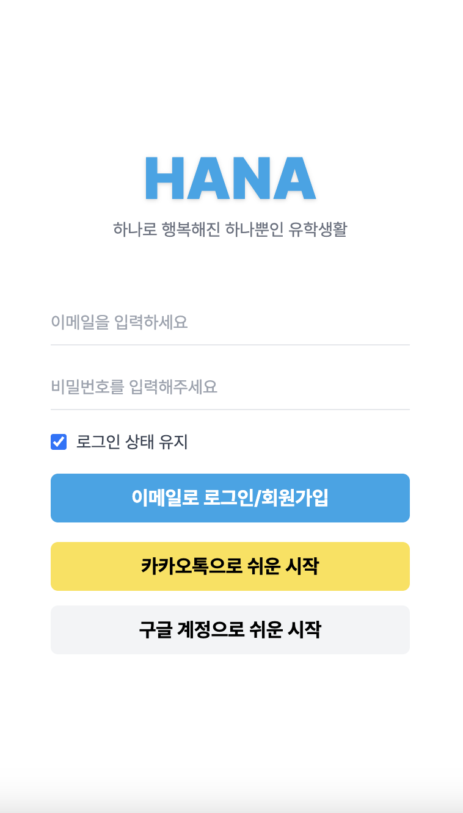
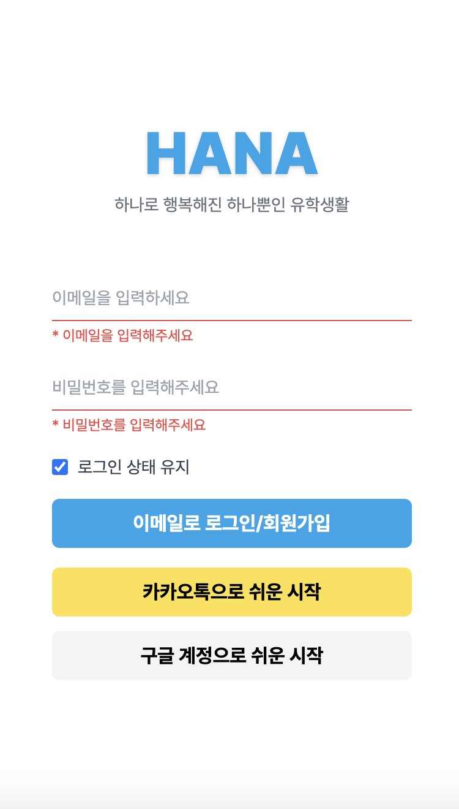
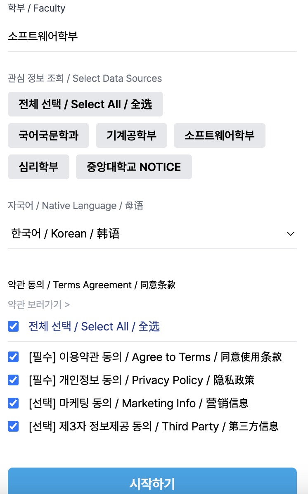
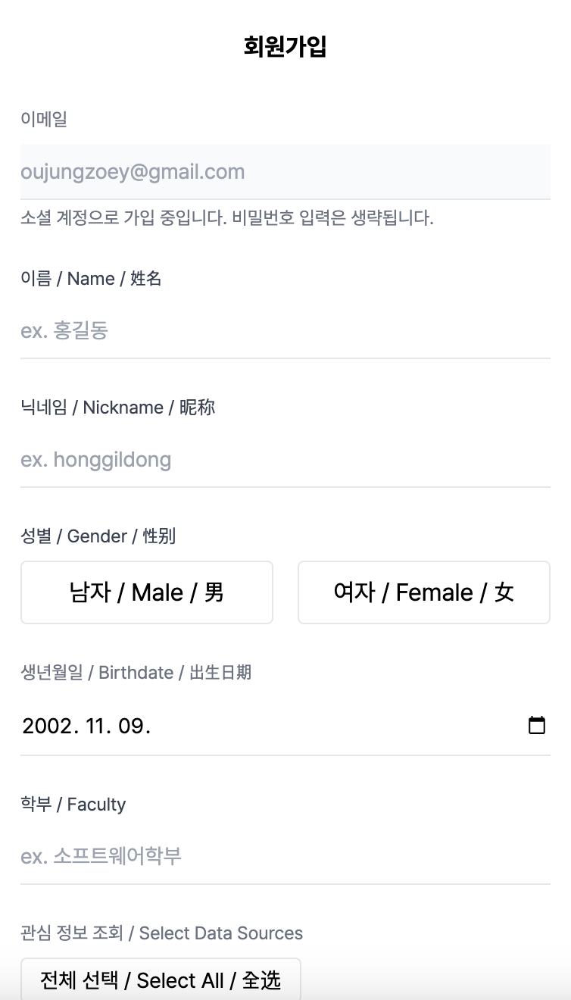
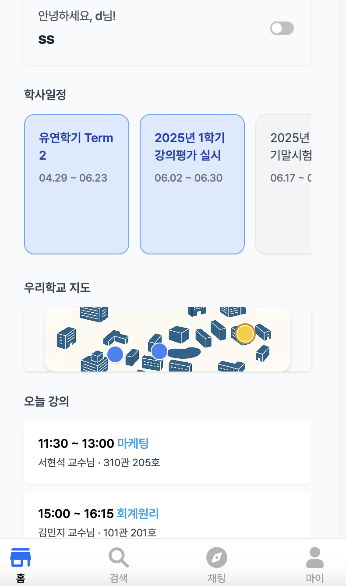
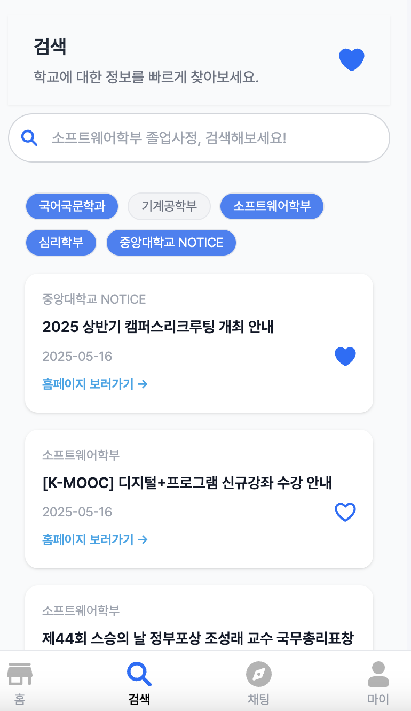
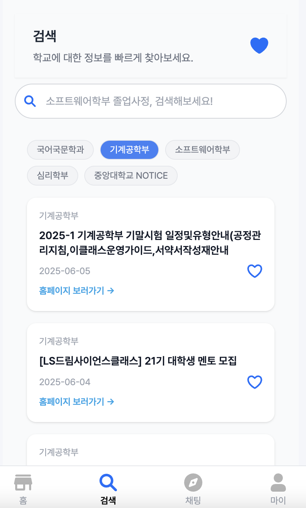
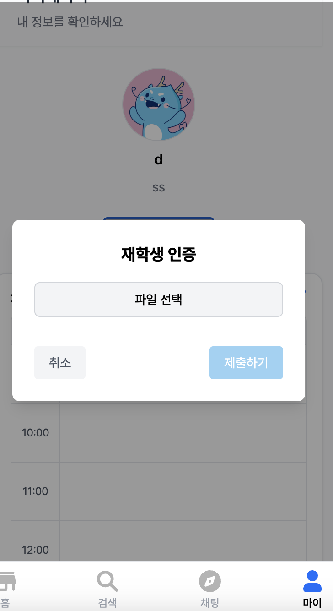
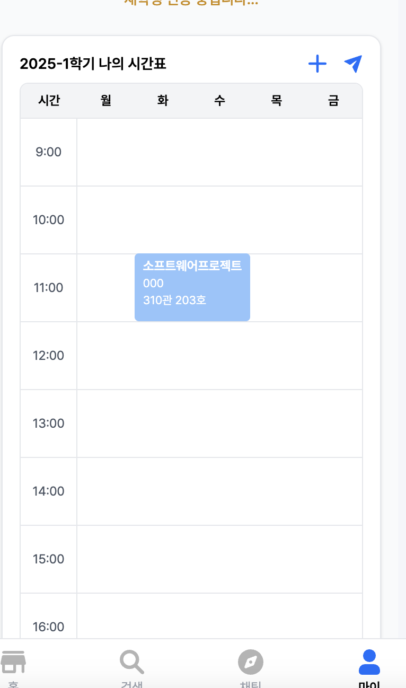
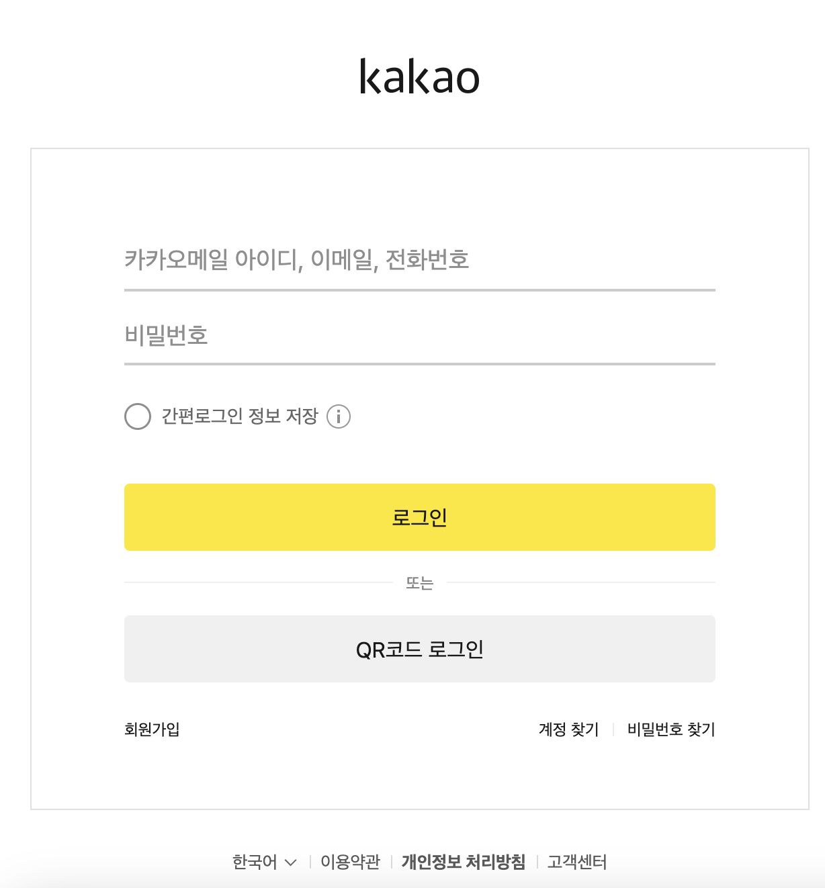

# HANA 프론트엔드

> 하나뿐인 유학생활을 위한 통합 플랫폼  
> `Next.js` 기반 프론트엔드 레포입니다.

---

## 🎨 화면 구성

## 🎨 화면 구성

| 화면 이름 | 미리보기 |
|-----------|----------|
| 스프린트 |  |
| 로그인 화면 |  |
| 오류 안내 |  |
| 회원가입 선택 화면 |  |
| 회원가입 온보딩 화면 |  |
| 홈 화면 |  |
| 검색 |  |
| 검색 필터 |  |
| 챗봇 |  |
| 마이페이지 - 재학생 인증 |  |
| 시간표 등록 |  |
| 카카오톡 연동 |  |

---

## 🧭 프로젝트 구조

```

hana\_client/
├── .env.local             # 로컬 환경변수 (API\_URL, OAuth 키 등)
├── app/                   # App Router 기반 페이지 구조 (`/home`, `/chatbot` 등)
├── components/            # 기능별 UI 컴포넌트 모음
│   ├── auth/              # 로그인/회원가입 관련 컴포넌트
│   ├── chat/              # 챗 UI 컴포넌트
│   ├── modals/            # 모달 컴포넌트
│   ├── profile/           # 프로필 관련 UI
│   ├── timetable/         # 시간표 컴포넌트
│   └── ui/                # 범용 UI (Button, Input 등)
├── contexts/              # React Context API
├── hoc/                   # 고차 컴포넌트 (e.g. 로그인 보호)
├── hooks/                 # 커스텀 훅 (useAuth, useModal 등)
├── lib/                   # API 클라이언트 / 비즈니스 로직
├── public/                # 정적 자산 (이미지, 아이콘 등)
├── utils/                 # 유틸 함수 (날짜, 쿠키 등)
├── tailwind.config.js     # Tailwind CSS 설정
└── package.json

````

---

## ⚙️ 기술 스택

| 기술             | 설명                                      |
|------------------|-------------------------------------------|
| **Next.js 14**   | App Router 기반 페이지 라우팅             |
| **React + TS**   | UI 렌더링 및 타입 안정성 확보            |
| **Tailwind CSS** | 유연하고 빠른 스타일링                   |
| **shadcn/ui**    | 범용 UI 컴포넌트                          |
| **Vercel**       | 정적 호스팅(예정)                          |

---

## 🚀 실행 가이드

```bash
cd hana-client
npm install
npm run dev
````

→ [http://localhost:3000](http://localhost:3000)

---

## 🔐 로그인 / 회원가입 흐름

* `/users/login` 호출 — 이메일 또는 소셜 로그인
* 로그인 실패 시 자동 회원가입
* JWT 발급 및 `localStorage` 저장 → `/home` 리디렉션

---

## 📁 주요 디렉토리

* **`app/`**: 페이지 단위 라우팅
* **`components/{auth,chat,modals,...}`**: 기능별 컴포넌트
* **`components/ui/`**: Button, Input 등 UI 원자 컴포넌트
* **`contexts/`**: Context API 기반 전역 상태
* **`hoc/`**: 권한 보호 등 고차 컴포넌트
* **`hooks/`**: `useAuth`, `useModal`, `useScroll` 등
* **`lib/`**: API 함수 (`apiClient.ts`, `auth.ts` 등)
* **`utils/`**: `formatDate`, `cookieUtil`, 기타 헬퍼
* **`public/`**: SVG, 이미지, og\:image 등 정적 파일

---

## 🧑‍💻 개발자 가이드

### ✏️ 커밋 메시지

Conventional Commits 사용:

```
feat(auth): 로그인 통합 처리
fix(chat): 메시지 중복 버그 수정
style: Pretendard, Tailwind 적용
```

### ⚙️ 환경변수

`.env.local` 예시:

```env
NEXT_PUBLIC_API_URL=http://localhost:8000
NEXT_PUBLIC_KAKAO_CLIENT_ID=...
NEXT_PUBLIC_GOOGLE_CLIENT_ID=...
```

`.env.local`은 `.gitignore`에 포함되어 있습니다.

---

## 📄 License

이 프로젝트는 [MIT License](./LICENSE)를 따릅니다.

---

## 🙋‍♀️ 주요 기여자

| 이름            | 역할       |
| ------------- | -------- |
| 이유정(@youjung) | 프론트엔드 리드 |

````
